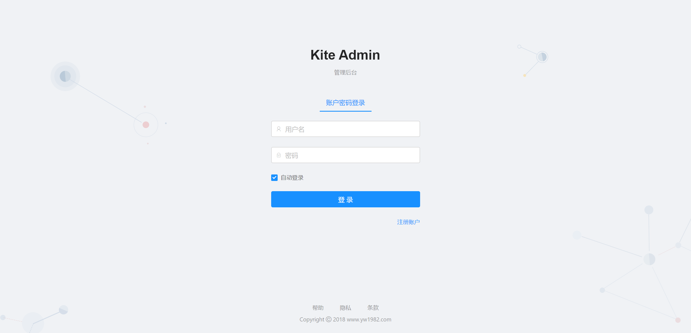
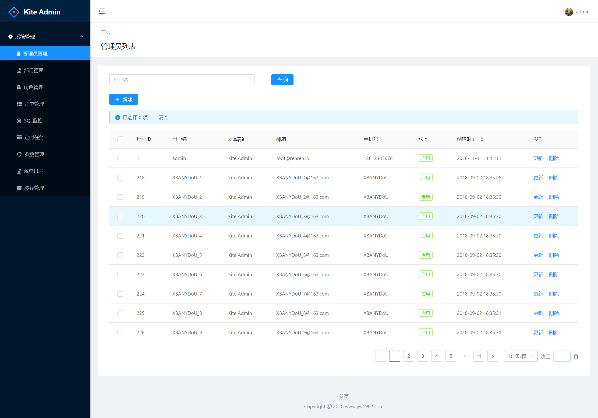
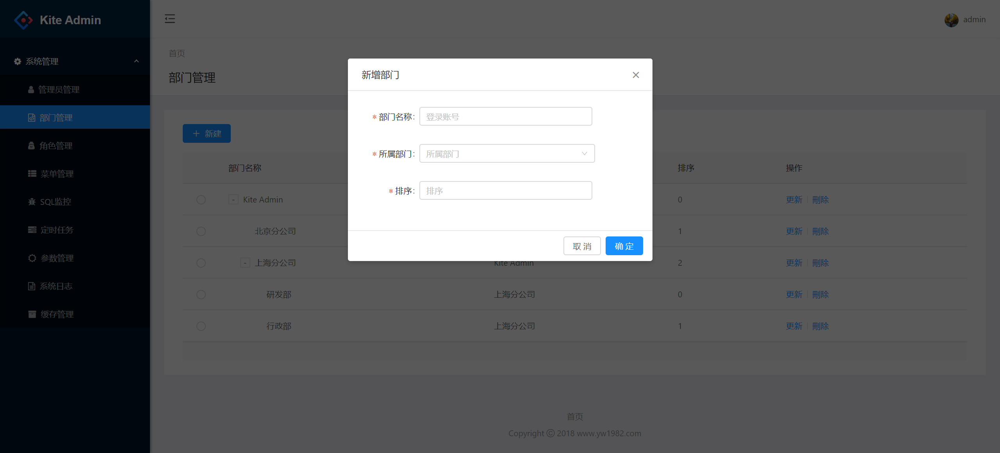
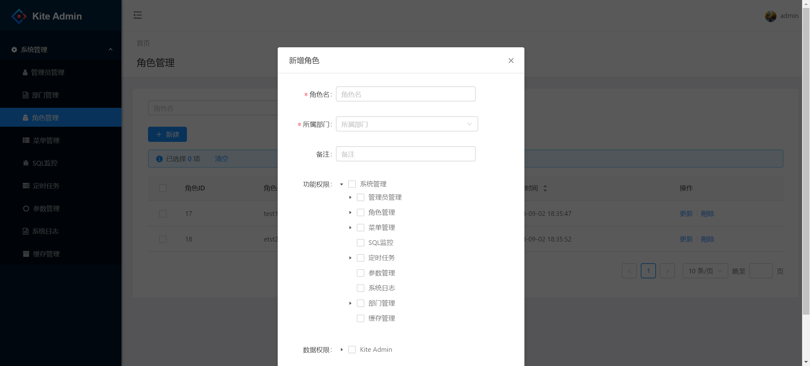
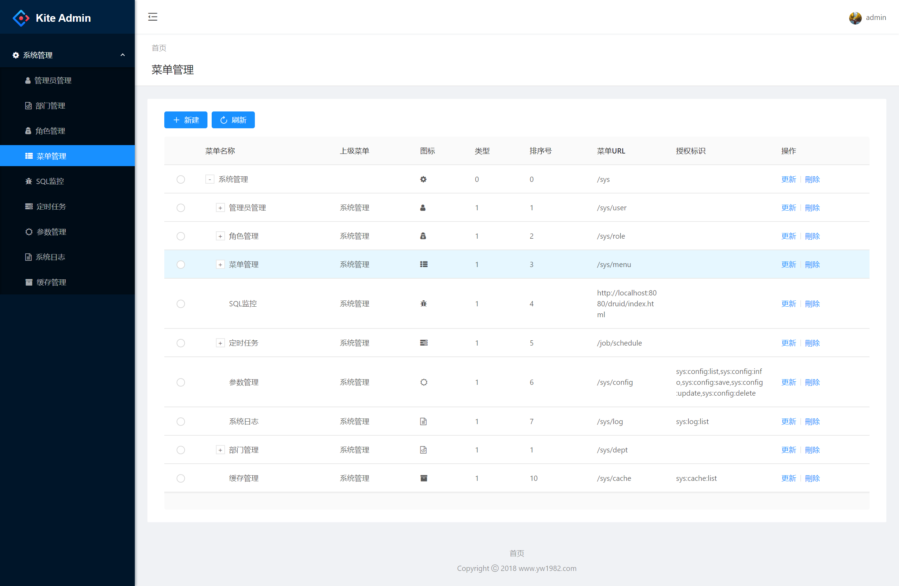
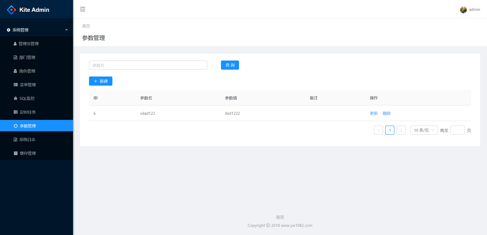
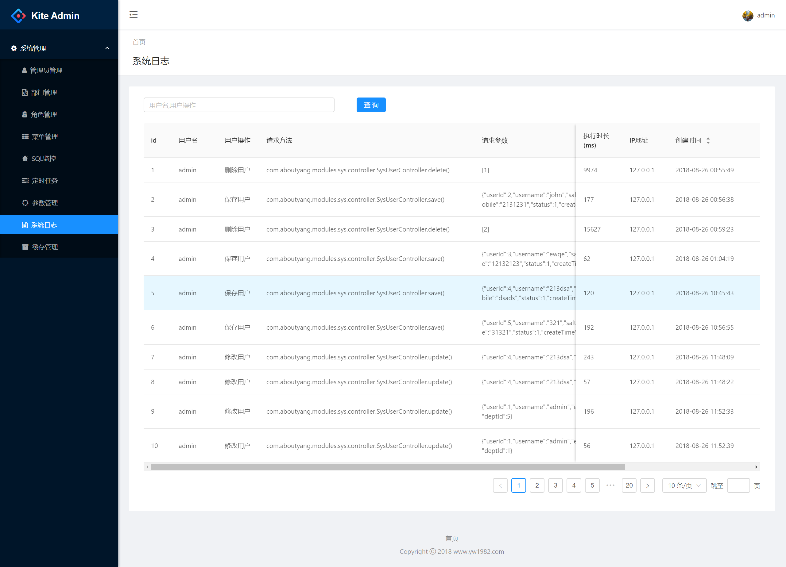
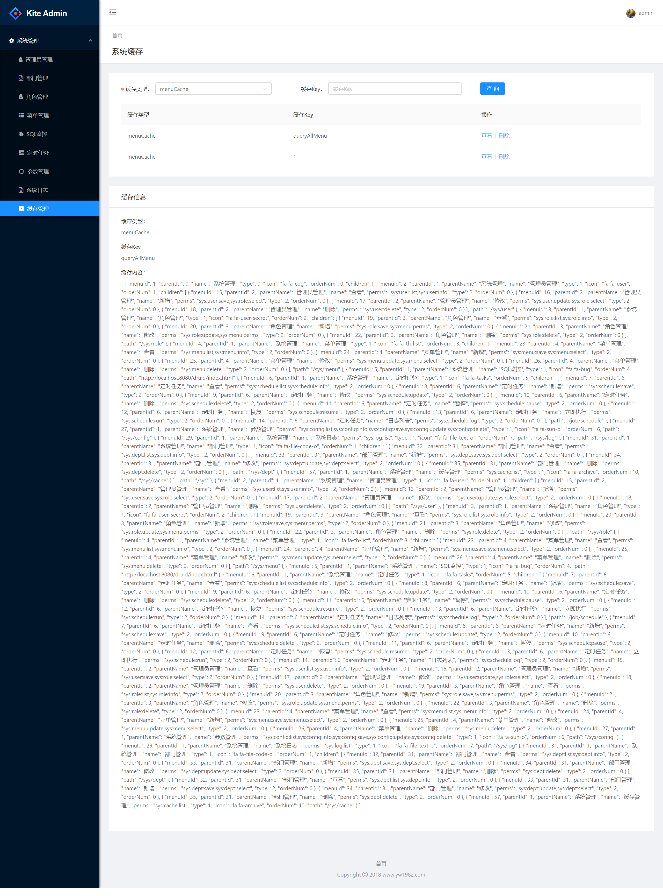
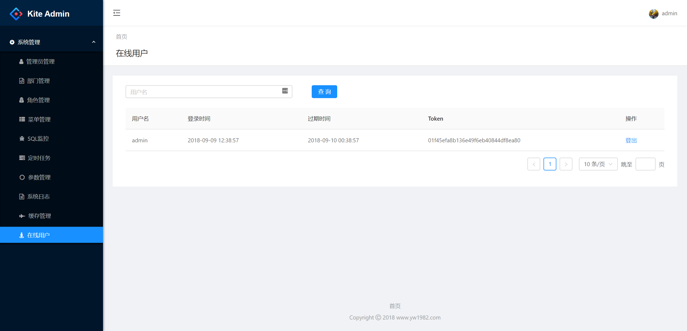

## kite-admin-web

后端系统访问访问 [kite-admin-web](https://github.com/aboutyang/kite)

### 1. 系统介绍

Kite 是一个后端管理系统快速开发的脚手架。整个系统为前后端分离模式，使用 RESTful API 进行通信。前端使用 react 基于 [ant design pro](https://pro.ant.design/) 进行开发

- 本脚手架基于Spring 2.0 开发。
- 数据访问使用MyBatis，后续加入JPA的支持。
- 访问权限使用Shiro，自定义实现了基于角色控制的访问权限。并加入对 JWT 的支持， 加速系统访问速度。 
- 可灵活的监控 RESTful 请求和响应的报文；此功能在开发的时候使用，会损耗性能。

### 2. 系统功能

  系统管理

- [  管理员管理 ]
- [  部门管理 ]
- [  角色管理 ]
- [  菜单管理 ]
- [  SQL监控 ]
- [  定时任务 ]
- [  参数管理 ]
- [  系统日志 ]
- [  缓存管理 ]
- [  在线用户 ]

### 3. 系统截图

